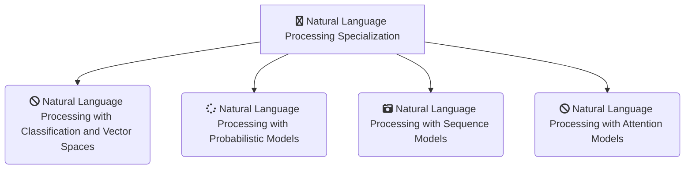

<h1 align="center">
  Natural Language Processing Specialization
</h1>
 

### Table of contents

- [Curriculum](https://github.com/jmcheon/natural_language_processing_specialization/wiki/Curriculum)
  - [Course1 - Natural Language Processing with Classification and Vector Spaces](https://github.com/jmcheon/natural_language_processing_specialization/tree/main/Course1) (4 Modules)
  - [Course2 - Natural Language Processing with Probabilistic Models](https://github.com/jmcheon/natural_language_processing_specialization/tree/main/Course2) (4 Modules)
  - [Course3 - Natural Language Processing with Sequence Models](https://github.com/jmcheon/natural_language_processing_specialization/tree/main/Course3) (3 Modules)
  - [Course4 - Natural Language Processing with Attention Models](https://github.com/jmcheon/natural_language_processing_specialization/tree/main/Course4) (3 Modules)

## About this Specialization

### Course1 - Natural Language Processing with Classification and Vector Spaces
- Module1 - Sentiment Analysis with Logistic Regression
- Module2 - Sentiment Analysis with Naïve Bayes
- Module3 - Vector Space Models
- Module4 - Machine Translation and Document Search

### Course2 - Natural Language Processing with Probabilistic Models
- Module1 - Autocorrect
- Module2 - Part of Speech Tagging and Hidden Markov Models
- Module3 - Autocomplete and Language Models
- Module4 - Word Embeddings with Neural Networks

### Course3 - Natural Language Processing with Sequence Models
- Module1 - Recurrent Neural Networks for Language Modeling
- Module2 - LSTMs and Named Entity Recognition
- Module3 - Siamese Networks

### Course4 - Natural Language Processing with Attention Models
- Module1 - Neural Machine Translation
- Module2 - Text Summarization
- Module3 - Question Answering

## Certificates

[Natural Language Processing Specialization](https://www.coursera.org/account/accomplishments/specialization/PX9A5NNNMO0G) (Feb 10, 2025)
  - [Course1 - Natural Language Processing with Classification and Vector Spaces](https://www.coursera.org/account/accomplishments/certificate/OLL0JADUGNGA) (Dec 1, 2024)
  - [Course2 - Natural Language Processing with Probabilistic Models](https://www.coursera.org/account/accomplishments/certificate/IPFZBP87SMI2) (Jan 10, 2025)
  - [Course3 - Natural Language Processing with Sequence Models](https://www.coursera.org/account/accomplishments/certificate/UOFMEPUM9AMS) (Jan 23, 2025)
  - [Course4 - Natural Language Processing with Attention Models](https://www.coursera.org/account/accomplishments/certificate/2PLRCMFCWQTX) (Feb 10, 2025)

## References
[Natural Language Processing Specialization](https://www.coursera.org/specializations/natural-language-processing)